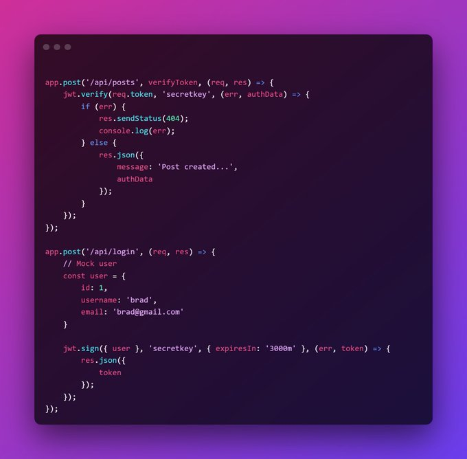
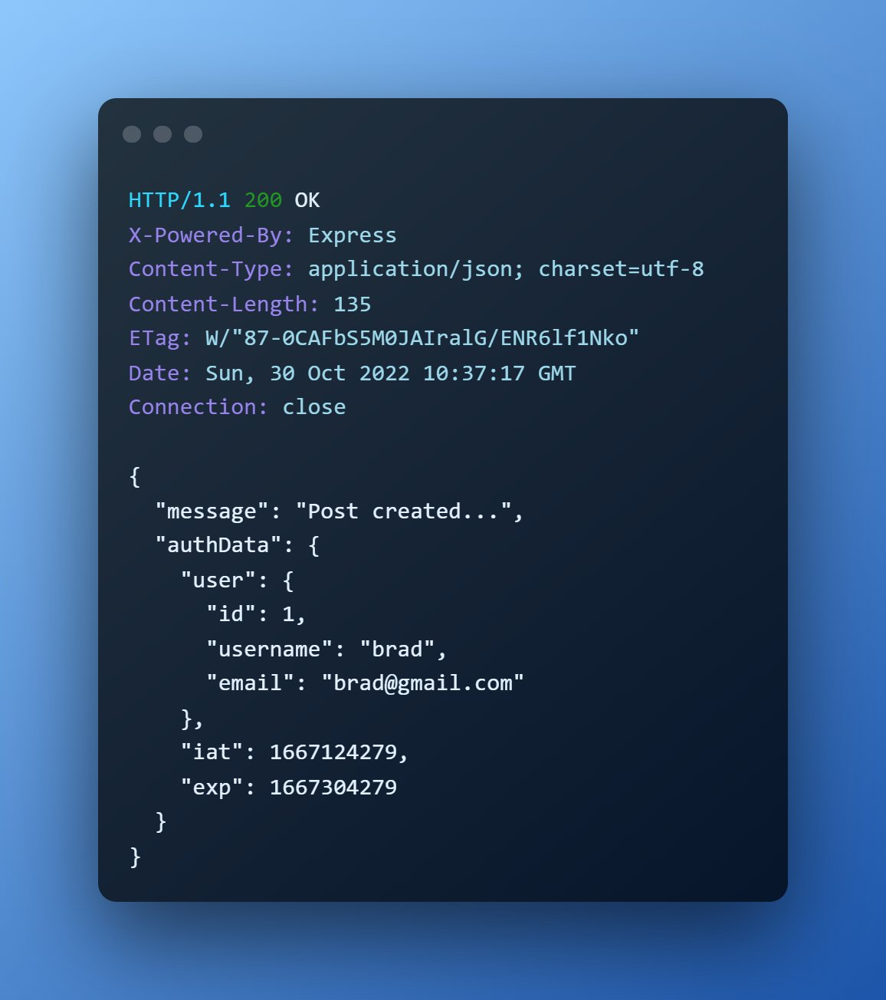
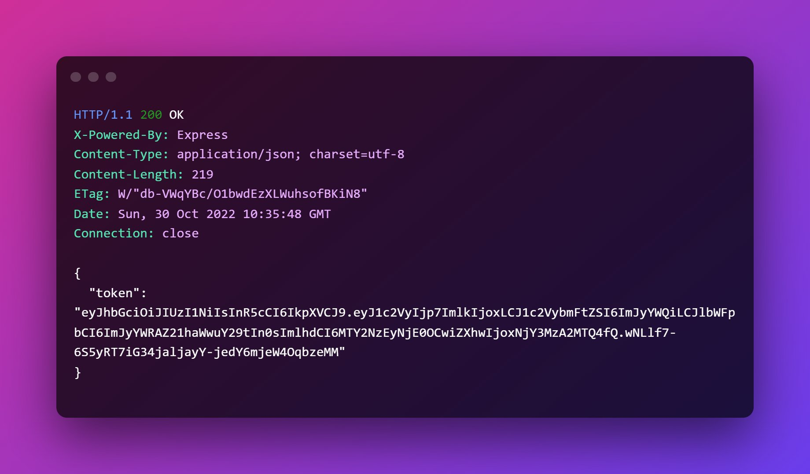
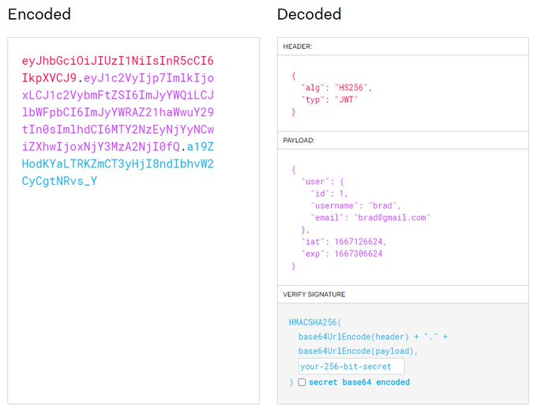

# Day 2 of 100 DaysOfCode

1. ▶ Implemented JWT Token #javascript with #NodeJS  Express.js

2. ▶ Used Http Rest Client for VS CODE <https://github.com/Huachao/vscode-restclient>

See in the Thread🧵 for the Code and result

| code | HTTP API REQUEST Sapmle     |
| :-------- | :------- |
|  | |

| TOKEN DATA | TOKEN     |
| :-------- | :------- |
|  | |

[JWT TOKEN DEBUGGER](https://jwt.io/#debugger-io)

## Token ➡

Part 1.2.3.4(optional) ➡
`eyJhbGciOiJIUzI1NiIsInR5cCI6IkpXVCJ9`
.`eyJ1c2VyIjp7ImlkIjoxLCJ1c2VybmFtZSI6ImJyYWQiLCJlbWFpbCI6ImJyYWRAZ21haWwuY29tIn0sImlhdCI6MTY2NzEyNjYyNCwiZXhwIjoxNjY3MzA2NjI0fQ`.
`a19ZHodKYaLTRKZmCT3yHjI8ndIbhvW2CyCgtNRvs_Y`
