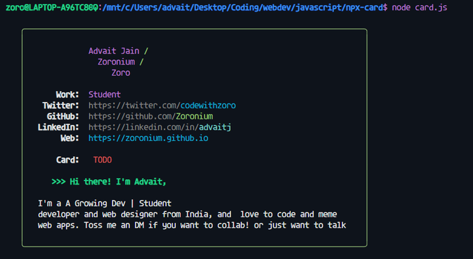

# This is Day 3 of 100days Of code

Demo Picture -

Link to Tweet - [tweet](https://twitter.com/codewithzoro/status/1587176638185603072)

## Today I learned

▶ `#NodeJS CLI` app. with `Chalk.js` and `Boxen.js`

▶ Learned That you should use import instead of require in Node `#javascript`  apps

Links and code in [source](../Day%203NPXcard/)
