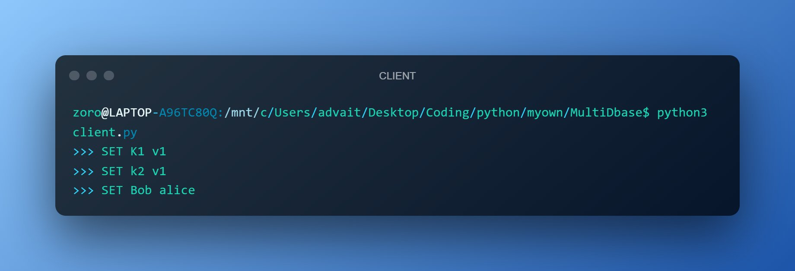
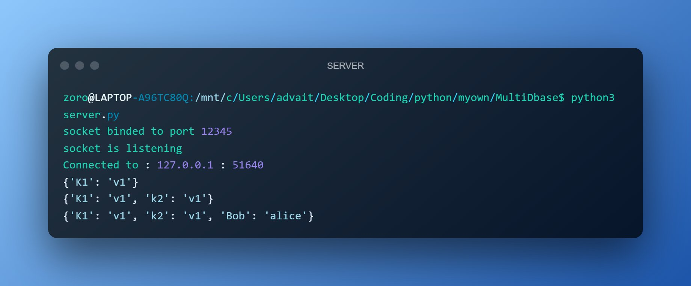
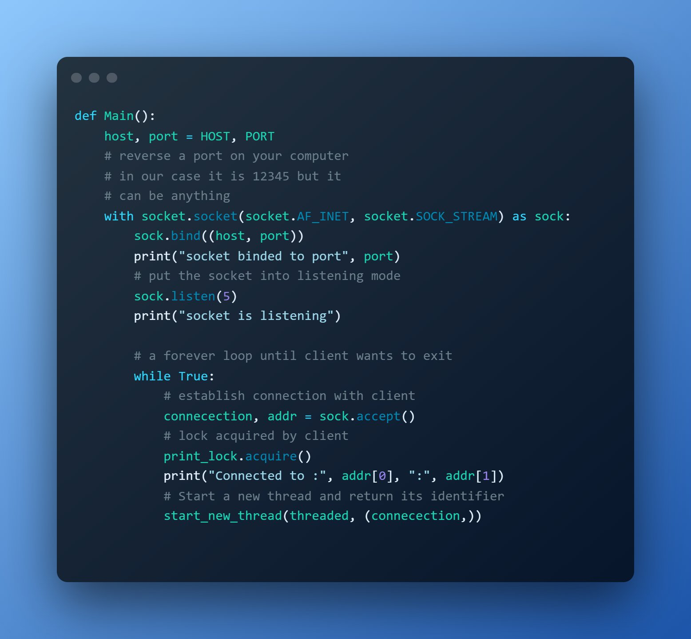
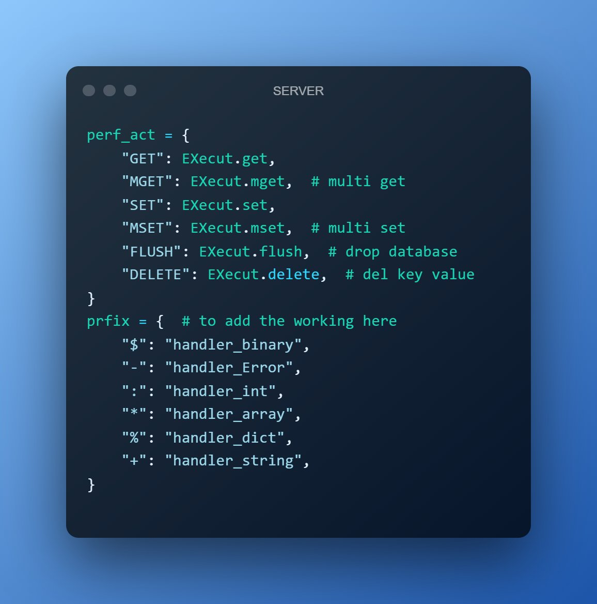
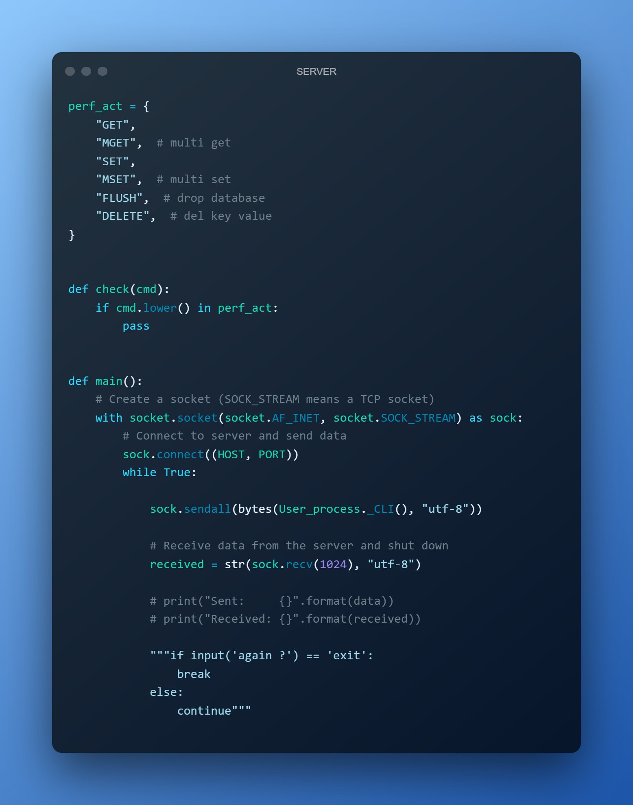

# Day 5️⃣-6️⃣ of #100DaysOfCode ✅

Today i

This database can store data in cache(which is fast , but can only be used when it is running or the data is volatile) [this will soon have a way to save data permanatly] this can be used as a Simple , fast , small DB for any thing which is more focused on storage and speed

- ▶ TRIED to make a Simple NOSQL server with #Python

- ▶ Used
  - socket,
  - _thread,  
  - threading Library in py

SAMPLE of server in images And Code
Outputs

Code server

Code client

