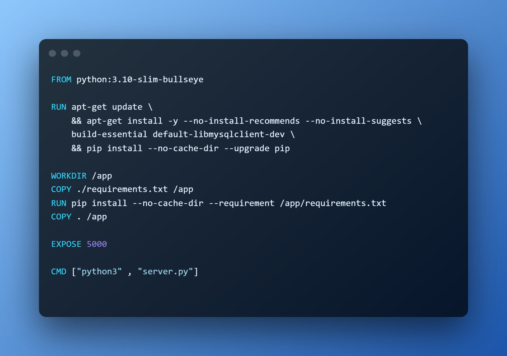
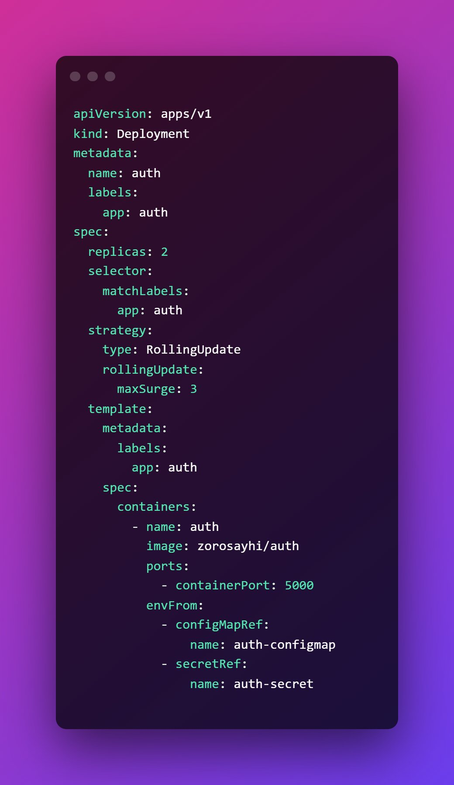

# Day 9️⃣ of #100DaysOfCode ✅

## today I implemented

### ▶ Dockerized the Flask JWT server #Docker  

### ▶ Made an image for the project on🐳 Docker Hub

**link**  ➡ <https://hub.docker.com/r/zorosayhi/auth>

or

```bash
 𝗱𝗼𝗰𝗸𝗲𝗿 𝗽𝘂𝗹𝗹 𝘇𝗼𝗿𝗼𝘀𝗮𝘆𝗵𝗶/𝗮𝘂𝘁𝗵
```

### ▶ Tried Some #Kubernetes

## DockerFile  



## Kubernates


